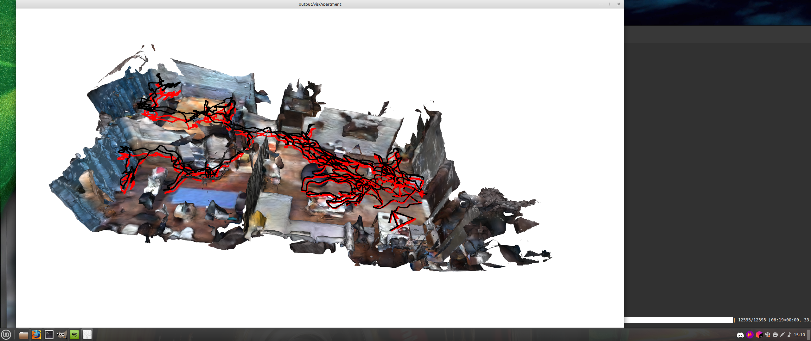
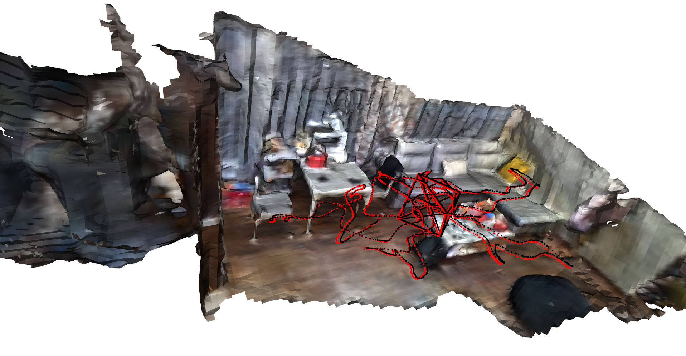
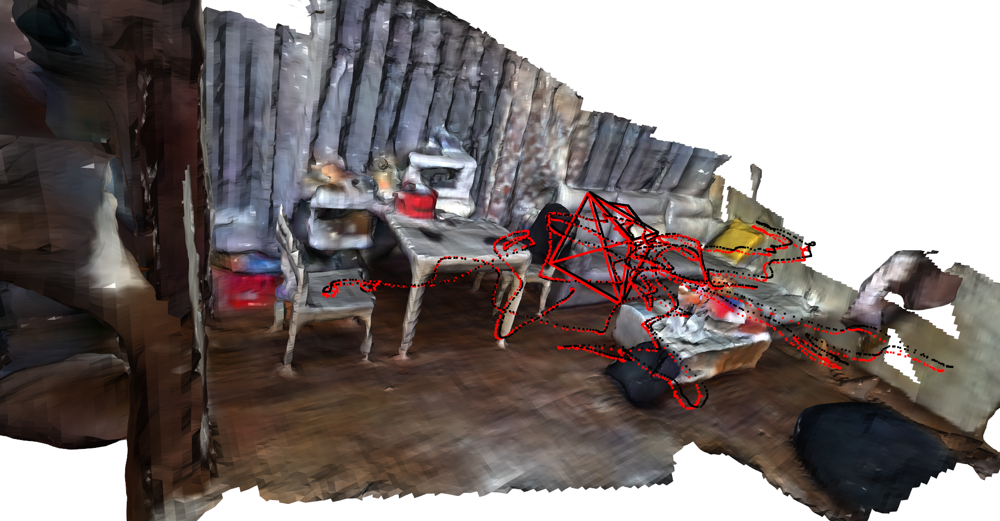

`The most recent notes are always at the top.`


# 2025-04-04


---
# Getting Project to work 

2025-03-19


```
Building wheels for collected packages: mathutils, openexr
  Building wheel for mathutils (setup.py): started
  Building wheel for mathutils (setup.py): finished with status 'error'
  
  
  
  
  pip subprocess error:
  error: subprocess-exited-with-error
  
  × python setup.py bdist_wheel did not run successfully.
  │ exit code: 1
  ╰─> [644 lines of output]
      running bdist_wheel
      running build
      running build_ext
      building 'mathutils' extension
      creating build
      creating build/temp.linux-x86_64-3.7
      creating build/temp.linux-x86_64-3.7/src
      creating build/temp.linux-x86_64-3.7/src/blenlib
      creating build/temp.linux-x86_64-3.7/src/blenlib/intern
      creating build/temp.linux-x86_64-3.7/src/generic
      creating build/temp.linux-x86_64-3.7/src/mathutils
      creating build/temp.linux-x86_64-3.7/src/stubs
      gcc -pthread -B /home/max/miniconda3/envs/nice-slam/compiler_compat -Wl,--sysroot=/ -Wsign-compare -DNDEBUG -g -fwrapv -O3 -Wall -Wstrict-prototypes -fPIC -DMATH_STANDALONE -DWITH_ASSERT_ABORT -Isrc/stubs -Isrc/blenlib -Isrc/makesdna -I/home/max/miniconda3/envs/nice-slam/include/python3.7m -c src/blenlib/intern/math_base.c -o build/temp.linux-x86_64-3.7/src/blenlib/intern/math_base.o -funsigned-char -Wno-sign-compare -Wno-strict-aliasing -std=gnu99
      
      
            gcc -pthread -B /home/max/miniconda3/envs/nice-slam/compiler_compat -Wl,--sysroot=/ -Wsign-compare -DNDEBUG -g -fwrapv -O3 -Wall -Wstrict-prototypes -fPIC -DMATH_STANDALONE -DWITH_ASSERT_ABORT -Isrc/stubs -Isrc/blenlib -Isrc/makesdna -I/home/max/miniconda3/envs/nice-slam/include/python3.7m -c src/stubs/stubs.c -o build/temp.linux-x86_64-3.7/src/stubs/stubs.o -funsigned-char -Wno-sign-compare -Wno-strict-aliasing -std=gnu99
      creating build/lib.linux-x86_64-3.7
      gcc -pthread -shared -B /home/max/miniconda3/envs/nice-slam/compiler_compat -L/home/max/miniconda3/envs/nice-slam/lib -Wl,-rpath=/home/max/miniconda3/envs/nice-slam/lib -Wl,--no-as-needed -Wl,--sysroot=/ build/temp.linux-x86_64-3.7/src/blenlib/intern/math_base.o build/temp.linux-x86_64-3.7/src/blenlib/intern/math_color.o build/temp.linux-x86_64-3.7/src/blenlib/intern/math_geom.o build/temp.linux-x86_64-3.7/src/blenlib/intern/math_matrix.o build/temp.linux-x86_64-3.7/src/blenlib/intern/math_rotation.o build/temp.linux-x86_64-3.7/src/blenlib/intern/math_vector.o build/temp.linux-x86_64-3.7/src/generic/py_capi_utils.o build/temp.linux-x86_64-3.7/src/mathutils/mathutils.o build/temp.linux-x86_64-3.7/src/mathutils/mathutils_Color.o build/temp.linux-x86_64-3.7/src/mathutils/mathutils_Euler.o build/temp.linux-x86_64-3.7/src/mathutils/mathutils_Matrix.o build/temp.linux-x86_64-3.7/src/mathutils/mathutils_Quaternion.o build/temp.linux-x86_64-3.7/src/mathutils/mathutils_Vector.o build/temp.linux-x86_64-3.7/src/mathutils/mathutils_geometry.o build/temp.linux-x86_64-3.7/src/mathutils/mathutils_interpolate.o build/temp.linux-x86_64-3.7/src/stubs/stubs.o -o build/lib.linux-x86_64-3.7/mathutils.cpython-37m-x86_64-linux-gnu.so
      /home/max/miniconda3/envs/nice-slam/compiler_compat/ld: /lib/x86_64-linux-gnu/libc.so.6: unknown type [0x13] section `.relr.dyn'
      /home/max/miniconda3/envs/nice-slam/compiler_compat/ld: skipping incompatible /lib/x86_64-linux-gnu/libc.so.6 when searching for /lib/x86_64-linux-gnu/libc.so.6
      /home/max/miniconda3/envs/nice-slam/compiler_compat/ld: /lib/x86_64-linux-gnu/libc.so.6: unknown type [0x13] section `.relr.dyn'
      /home/max/miniconda3/envs/nice-slam/compiler_compat/ld: skipping incompatible /lib/x86_64-linux-gnu/libc.so.6 when searching for /lib/x86_64-linux-gnu/libc.so.6
      /home/max/miniconda3/envs/nice-slam/compiler_compat/ld: cannot find /lib/x86_64-linux-gnu/libc.so.6
      /home/max/miniconda3/envs/nice-slam/compiler_compat/ld: /lib/x86_64-linux-gnu/libc.so.6: unknown type [0x13] section `.relr.dyn'
      /home/max/miniconda3/envs/nice-slam/compiler_compat/ld: skipping incompatible /lib/x86_64-linux-gnu/libc.so.6 when searching for /lib/x86_64-linux-gnu/libc.so.6
      /home/max/miniconda3/envs/nice-slam/compiler_compat/ld: /lib/x86_64-linux-gnu/libc.so.6: unknown type [0x13] section `.relr.dyn'
      /home/max/miniconda3/envs/nice-slam/compiler_compat/ld: skipping incompatible /lib/x86_64-linux-gnu/libc.so.6 when searching for /lib/x86_64-linux-gnu/libc.so.6
      /home/max/miniconda3/envs/nice-slam/compiler_compat/ld: /lib64/ld-linux-x86-64.so.2: unknown type [0x13] section `.relr.dyn'
      /home/max/miniconda3/envs/nice-slam/compiler_compat/ld: skipping incompatible /lib64/ld-linux-x86-64.so.2 when searching for /lib64/ld-linux-x86-64.so.2
      /home/max/miniconda3/envs/nice-slam/compiler_compat/ld: /lib64/ld-linux-x86-64.so.2: unknown type [0x13] section `.relr.dyn'
      /home/max/miniconda3/envs/nice-slam/compiler_compat/ld: skipping incompatible /lib64/ld-linux-x86-64.so.2 when searching for /lib64/ld-linux-x86-64.so.2
      /home/max/miniconda3/envs/nice-slam/compiler_compat/ld: cannot find /lib64/ld-linux-x86-64.so.2
      /home/max/miniconda3/envs/nice-slam/compiler_compat/ld: /lib64/ld-linux-x86-64.so.2: unknown type [0x13] section `.relr.dyn'
      /home/max/miniconda3/envs/nice-slam/compiler_compat/ld: skipping incompatible /lib64/ld-linux-x86-64.so.2 when searching for /lib64/ld-linux-x86-64.so.2
      /home/max/miniconda3/envs/nice-slam/compiler_compat/ld: /lib64/ld-linux-x86-64.so.2: unknown type [0x13] section `.relr.dyn'
      /home/max/miniconda3/envs/nice-slam/compiler_compat/ld: skipping incompatible /lib64/ld-linux-x86-64.so.2 when searching for /lib64/ld-linux-x86-64.so.2
      collect2: error: ld returned 1 exit status
      error: command '/usr/bin/gcc' failed with exit code 1
      [end of output]
```


eigene environment file angelegt mit wenigen dependencies, nach und nach erweitert und mit conda versucht die umgebung zu bauen, hat geklappt.


die proj env file hat conda dann auch gefressen ohne dass ich änderungen an der config file vornehmen musste.

irgendwo muss sich conda da festgefahren haben.





Beispiele Laden und rendern.


## Demo

15:22 start


---


rendering some example, iterrupted manueally after ~3 hours

Mapping Frame  2370

Tracking: update the parameters from mapping

Tracking Frame  2371

Re-rendering loss: 886.74->664.51 camera tensor error: 0.0084->0.0074

Tracking Frame  2372

Re-rendering loss: 1190.85->715.79 camera tensor error: 0.0067->0.0085

Tracking Frame  2373

Re-rendering loss: 1107.27->748.37 camera tensor error: 0.0097->0.0080

Tracking Frame  2374

Re-rendering loss: 884.58->686.78 camera tensor error: 0.0098->0.0089

Tracking Frame  2375

Re-rendering loss: 652.44->618.39 camera tensor error: 0.0095->0.0099

Coarse Mapping Frame  2375


Mapping Frame  2375

Tracking: update the parameters from mapping

Tracking Frame  2376

^CProcess Process-2:
Process Process-3:
Traceback (most recent call last):
  File "run.py", line 45, in <module>
    main()
  File "run.py", line 41, in main
    slam.run()
  File "/home/max/NICE_SLAM/src/src/NICE_SLAM.py", line 307, in run
    p.join()
  File "/home/max/miniconda3/envs/nice-slam/lib/python3.7/multiprocessing/process.py", line 140, in join
    res = self._popen.wait(timeout)
  File "/home/max/miniconda3/envs/nice-slam/lib/python3.7/multiprocessing/popen_fork.py", line 48, in wait
    return self.poll(os.WNOHANG if timeout == 0.0 else 0)
  File "/home/max/miniconda3/envs/nice-slam/lib/python3.7/multiprocessing/popen_fork.py", line 28, in poll
    pid, sts = os.waitpid(self.pid, flag)
Traceback (most recent call last):
Traceback (most recent call last):
KeyboardInterrupt
  File "/home/max/miniconda3/envs/nice-slam/lib/python3.7/multiprocessing/process.py", line 297, in _bootstrap
    self.run()
  File "/home/max/miniconda3/envs/nice-slam/lib/python3.7/multiprocessing/process.py", line 99, in run
    self._target(*self._args, **self._kwargs)
  File "/home/max/miniconda3/envs/nice-slam/lib/python3.7/multiprocessing/process.py", line 297, in _bootstrap
    self.run()
  File "/home/max/NICE_SLAM/src/src/NICE_SLAM.py", line 276, in mapping
    self.mapper.run()
  File "/home/max/NICE_SLAM/src/src/Mapper.py", line 563, in run
    time.sleep(0.1)
  File "/home/max/miniconda3/envs/nice-slam/lib/python3.7/multiprocessing/process.py", line 99, in run
    self._target(*self._args, **self._kwargs)
KeyboardInterrupt
  File "/home/max/NICE_SLAM/src/src/NICE_SLAM.py", line 286, in coarse_mapping
    self.coarse_mapper.run()
  File "/home/max/NICE_SLAM/src/src/Mapper.py", line 563, in run
    time.sleep(0.1)
KeyboardInterrupt
[W CudaIPCTypes.cpp:15] Producer process has been terminated before all shared CUDA tensors released. See Note [Sharing CUDA tensors]
Process Process-1:
Traceback (most recent call last):
  File "/home/max/miniconda3/envs/nice-slam/lib/python3.7/multiprocessing/process.py", line 297, in _bootstrap
    self.run()
  File "/home/max/miniconda3/envs/nice-slam/lib/python3.7/multiprocessing/process.py", line 99, in run
    self._target(*self._args, **self._kwargs)
  File "/home/max/NICE_SLAM/src/src/NICE_SLAM.py", line 266, in tracking
    self.tracker.run()
  File "/home/max/NICE_SLAM/src/src/Tracker.py", line 233, in run
    camera_tensor, gt_color, gt_depth, self.tracking_pixels, optimizer_camera)
  File "/home/max/NICE_SLAM/src/src/Tracker.py", line 107, in optimize_cam_in_batch
    self.c, self.decoders, batch_rays_d, batch_rays_o,  self.device, stage='color',  gt_depth=batch_gt_depth)
  File "/home/max/NICE_SLAM/src/src/utils/Renderer.py", line 176, in render_batch_ray
    raw = self.eval_points(pointsf, decoders, c, stage, device)
  File "/home/max/NICE_SLAM/src/src/utils/Renderer.py", line 43, in eval_points
    mask_x = (pi[:, 0] < bound[0][1]) & (pi[:, 0] > bound[0][0])
KeyboardInterrupt





